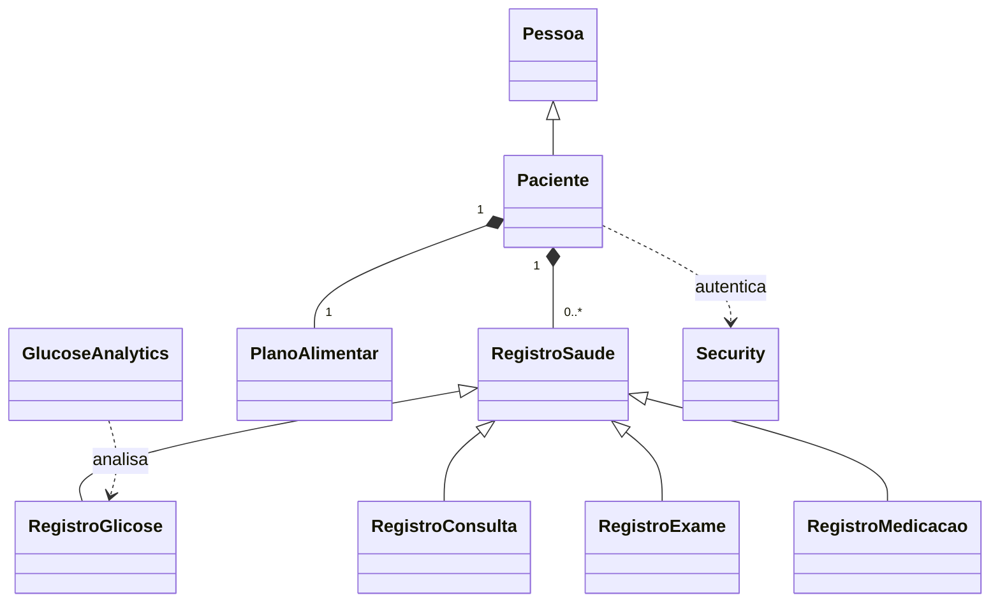

<h1 align="center">🩸 DiaryBetes</h1>

<p align="center">
  <strong>Diário clínico de acompanhamento da diabetes</strong><br>
  Registro de glicose, consultas, exames, medicações e plano alimentar — com
  análise estatística e indicadores glicêmicos no próprio terminal.
</p>

<p align="center">
  
  
  
  
</p>

> ⚕️ **Aviso médico:** projeto **acadêmico** (INF112 — Programação II). Não é um
> dispositivo médico certificado e não substitui avaliação profissional. As
> métricas exibidas são informativas.

---

## 📑 Sumário

- [Visão geral](#-visão-geral)
- [Funcionalidades](#-funcionalidades)
- [Indicadores clínicos](#-indicadores-clínicos-camada-de-data-science)
- [Arquitetura](#-arquitetura)
- [Segurança](#-segurança)
- [Banco de dados](#-banco-de-dados)
- [Instalação e execução](#-instalação-e-execução)
- [Como usar](#-como-usar)
- [Estrutura do projeto](#-estrutura-do-projeto)
- [Roadmap](#-roadmap)
- [Desenvolvimento](#-desenvolvimento)
- [Equipe](#-equipe)
- [Licença](#-licença)

---

## 📘 Visão geral

O **DiaryBetes** centraliza, em uma aplicação de linha de comando, todos os
registros relevantes para quem convive com a diabetes. Mais do que armazenar
dados, o sistema os **transforma em informação útil**: a partir do histórico de
glicose ele calcula estatísticas, estima o controle glicêmico e identifica
tendências, ajudando paciente e profissional de saúde a tomar decisões.

O projeto é escrito em **C++17** com persistência em **SQLite3**, modelado com
herança e colaboração entre classes e portado para Linux e Windows.

## ✨ Funcionalidades

| Domínio | Recursos |
|---|---|
| **Conta** | Cadastro e login com validação de CPF, idade, peso, altura e tipo sanguíneo |
| **Glicose** | Registro com data/hora e jejum; alertas automáticos de hipo/hiperglicemia |
| **Análise** | Painel estatístico, Tempo no Alvo, GMI/eA1c, tendência e *sparkline* |
| **Exportação** | Exportação do histórico de glicose em **CSV** para análise externa |
| **Consultas/Exames** | Agendamento e listagem, com validação de datas (passado/futuro) |
| **Medicações** | Cadastro com dosagem e intervalo, listagem ordenada |
| **Plano alimentar** | Cadastro e atualização de macronutrientes e restrições |
| **Segurança** | Senhas com *hash* PBKDF2 + *salt*; *prepared statements* em todo o SQL |

## 📊 Indicadores clínicos (camada de *data science*)

A opção **"Analisar glicose"** gera um painel com métricas reconhecidas no
manejo do diabetes, calculadas em uma passagem **O(n)** sobre os registros
(ordenação cronológica em **O(n log n)**):

| Métrica | Fórmula / Faixa | Referência |
|---|---|---|
| **Tempo no Alvo (TIR)** | % de leituras em 70–180 mg/dL | Consenso ADA |
| **GMI** | `3.31 + 0.02392 × média` | Bergenstal et al., 2018 |
| **A1c estimada (eA1c)** | `(média + 46.7) / 28.7` | Estudo ADAG (Nathan, 2008) |
| **Variabilidade (CV)** | `desvio padrão / média × 100` (alvo ≤ 36%) | Consenso ATTD |
| **Tendência** | inclinação por regressão linear (mínimos quadrados) | — |

Exemplo de saída:

```
                     ANALISE DE GLICOSE
============================================================

Estatisticas descritivas (mg/dL)
--------------------------------
  Leituras:                   15
  Media:                      133.2
  Mediana:                    128.0
  Desvio padrao:              36.9
  Variabilidade (CV):         27.7%

Controle glicemico estimado
---------------------------
  GMI (indicador de gestao):  6.50%
  A1c estimada (eA1c):        6.27%

Tempo no alvo (TIR)
-------------------
  No alvo       ###################..... 80.0%
  Abaixo (<70)  ##...................... 6.7%
  Acima (>180)  ###..................... 13.3%

Tendencia e serie temporal
--------------------------
  Tendencia:                  descendo (-1.96 mg/dL por leitura)
  Serie (antiga -> recente):  ▄▅▆█▄▁▅▇▃▇▃▅▃▄▃
```

## 🏛️ Arquitetura

O sistema combina **herança** (registros clínicos) e **colaboração** (serviços e
utilitários), com a persistência isolada em métodos de banco.



**Camadas e módulos:**

- **Domínio** — `Pessoa`, `Paciente`, `Medicacao`, `PlanoAlimentar`.
- **Registros** — `RegistroSaude` (base abstrata) e os derivados `RegistroGlicose`,
  `RegistroConsulta`, `RegistroExame`, `RegistroMedicacao`.
- **Serviços** — `GlucoseAnalytics` (estatística/relatórios), `DatabaseMethods`
  (consultas e validações).
- **Utilitários** — `Security` (hashing de senhas), `Console` (UI do terminal),
  `Time` (parsing/validação de horário).

> A herança no banco é representada via **chaves estrangeiras** (`RegistroSaude`
> referenciado pelos registros especializados).

## 🔐 Segurança

- **Senhas com *hash***: derivadas com **PBKDF2-HMAC-SHA256** (120 000 iterações)
  e ***salt* aleatório por usuário**, armazenadas como
  `pbkdf2_sha256$<iter>$<salt>$<hash>`. A verificação usa **comparação em tempo
  constante** para mitigar *timing attacks*.
- **Migração transparente**: contas legadas em texto puro são validadas uma vez
  e automaticamente reescritas como *hash* no primeiro login bem-sucedido.
- **Sem SQL injection**: toda interação com o banco usa *prepared statements* com
  *binding* de parâmetros.
- **Exception-safe**: as operações de banco liberam *statements* e conexões em
  todos os caminhos, inclusive em erro.

## 🗄️ Banco de dados

SQLite3, com o esquema versionado em [`database.db.sql`](database.db.sql). Para
recriar o banco do zero:

```bash
sqlite3 database.db < database.db.sql
```

Para popular uma série de glicose de demonstração (paciente Id = 1):

```bash
sqlite3 database.db < seed_demo.sql
```

## 🚀 Instalação e execução

### Pré-requisitos
- Compilador com **C++17** (g++ 9+).
- **make**.
- SQLite3 (o *amalgamation* já acompanha o projeto em `src/sqlite3.c`).

### Linux / macOS

```bash
git clone https://github.com/gabrielreisz/diarybets.git
cd diarybets
make            # compila (-Wall -Wextra)
./diarybetes    # executa
```

### Windows (MinGW-w64 / MSYS2)

```bash
make
diarybetes.exe
```

### Comandos do Makefile

| Comando | Ação |
|---|---|
| `make` | Compila o projeto |
| `make clean` | Remove objetos e binário |
| `make rebuild` | Limpa e recompila |

## 🕹️ Como usar

Ao iniciar, escolha **Criar conta** ou **Login**. Após autenticar, o menu
principal oferece:

```
1) Marcar uma consulta          8) Mudar plano alimentar
2) Exibir consultas marcadas    9) Exibir plano alimentar
3) Inserir resultado exame     10) Registrar um medicamento
4) Exibir exames marcados      11) Exibir medicamentos
5) Registrar nivel de glicose  12) Analisar glicose (painel)
6) Exibir registros de glicose 13) Exportar glicose (CSV)
7) Registrar plano alimentar   14) Sair
```

> Conta de demonstração (após carregar o banco semente): CPF `12345678901`,
> senha `senha123`.

## 📁 Estrutura do projeto

```
diarybets/
├── include/             # Cabeçalhos (.hpp)
│   ├── Security.hpp         # hashing de credenciais
│   ├── Console.hpp          # UI de terminal (cores/banners)
│   └── GlucoseAnalytics.hpp # métricas de glicose
├── src/                 # Implementações (.cpp)
├── main.cpp             # Ponto de entrada / menu
├── database.db.sql      # Esquema do banco
├── seed_demo.sql        # Dados de demonstração de glicose
├── diagram.mmd          # Diagrama de classes (Mermaid)
├── Makefile             # Build
├── CONTRIBUTING.md      # Fluxo de trabalho e padrões
├── CHANGELOG.md         # Histórico de mudanças
└── README.md
```

## 🗺️ Roadmap

- [ ] Camada `Database` (RAII) unificando abertura/fechamento de conexões.
- [ ] Testes automatizados (unitários para `Security` e `GlucoseAnalytics`).
- [ ] Relatório agregado por períodos (semana/mês) e por jejum vs. pós-prandial.
- [ ] Interface gráfica (ver branch [`gui/qt`](../../tree/gui/qt)).

## 🛠️ Desenvolvimento

Adotamos **Git Flow simplificado** (`feat/`, `fix/`, `refactor/`, `docs/`,
`chore/`), **Conventional Commits** e *merges* com `--no-ff`. Detalhes em
[CONTRIBUTING.md](CONTRIBUTING.md). Ferramentas de apoio: Notion, Slack, Discord
e GitHub.

## 🧍 Equipe

| Integrante | Matrícula |
|---|---|
| Gabriel Costa Reis | 120549 |
| Marcos Vinícius Mariano Dias | 120560 |
| Victor Alexandre Siqueira Ribeiro | 120557 |

## 📄 Licença

Distribuído sob a licença **MIT**. Veja [LICENSE](LICENSE).
